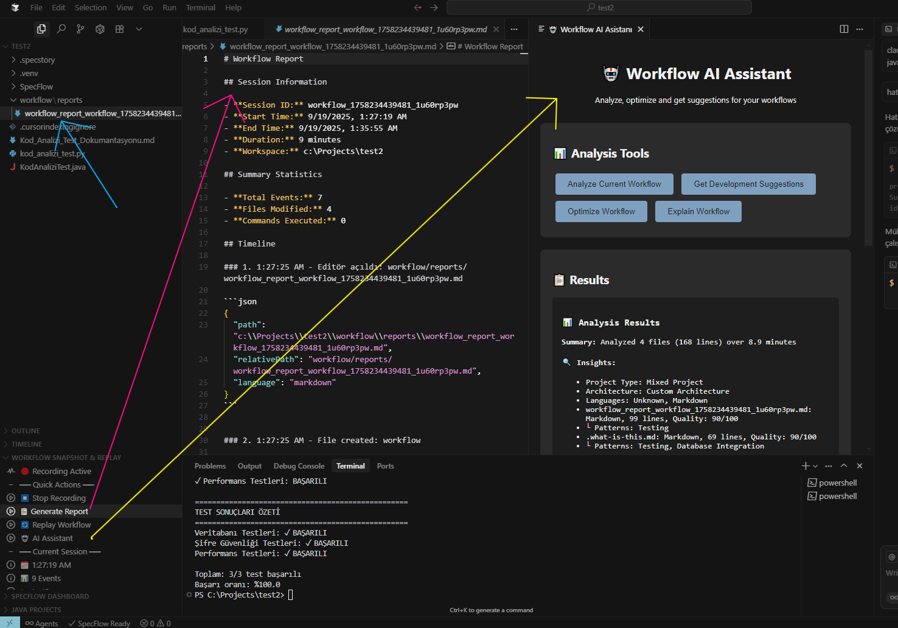

# Workflow Snapshot & Replay - AI-Native Development Workflow Extension

<div align="center">


[](https://marketplace.visualstudio.com/vscode)
[](https://cursor.sh/)
[](https://github.com/workflow-tools)

**Revolutionizing development workflow documentation with AI-powered recording and replay capabilities**

[Quick Start](#quick-start) • [Documentation](#documentation) • [Contributing](#contributing) • [Community](#community)

## Screenshots

<div align="center">

### Workflow Dashboard
*Real-time workflow tracking with Explorer panel integration*


*Coming Soon: Dashboard screenshot will be added*

### AI-Powered Analysis
*Native AI providing workflow optimization suggestions*


*Coming Soon: AI analysis screenshot will be added*

### Replay Experience
*Automated workflow reproduction across different environments*


*Coming Soon: Replay demonstration screenshot will be added*

</div>

</div>

## What is Workflow Snapshot & Replay?

Workflow Snapshot & Replay is the world's first **AI-native VS Code extension** that automatically captures your development workflow, generates beautiful Markdown documentation, and enables seamless workflow reproduction across different environments.

### Core Innovation: "Development Session Recording"

Instead of manually documenting your development process, Workflow Snapshot & Replay automatically captures every action:

```typescript
/**
 * Captured Workflow Example
 * Session: USER_WORKFLOW_001
 * Duration: 45 minutes
 * Files Modified: 12
 * Commands Executed: 8
 * 
 * Timeline:
 * 14:30:15 - File created: src/components/UserAuth.tsx
 * 14:30:45 - Text changed: Added login validation logic
 * 14:31:20 - Terminal command: npm install express-validator
 * 14:32:10 - File opened: src/routes/auth.js
 * 14:33:05 - AI Analysis: "Consider adding rate limiting"
 * 
 * Replay Instructions:
 * 1. Create UserAuth.tsx component
 * 2. Implement validation logic
 * 3. Install express-validator package
 * 4. Configure authentication routes
 */
```

## Key Features

### AI-Powered Workflow Analysis (No API Key Required!)
- **Native AI**: Built-in rule-based analysis and optimization suggestions
- **Real-time Monitoring**: Continuously tracks development activities
- **Smart Insights**: Context-aware productivity recommendations  
- **Multiple AI Options**: Native, Cursor, VS Code Copilot, or external APIs
- **Offline Support**: Works without internet connection

### Visual Explorer Dashboard
- **Progress Tracking**: Real-time workflow session status
- **Activity Monitoring**: Live tracking of file changes and commands
- **Quick Actions**: One-click record, stop, replay, and analyze
- **Session History**: Access to previous workflow sessions

### Zero-Friction Workflow
- **No Context Switching**: Everything happens within your editor
- **Automatic Documentation**: Workflows documented as you work
- **Git Integration**: Workflow sessions version with your code
- **Cross-Platform**: Works on Windows, macOS, and Linux

## Quick Start

### Prerequisites

- **VS Code** 1.74+ or **Cursor** latest version
- **Node.js** 18+ (for development)
- **AI Provider**: Built-in (no API key required!) or optional external API key

### Installation

#### From VSIX Package
```bash
# Install from VSIX file
code --install-extension workflow-snapshot-replay-0.1.0.vsix
```

#### From Source (Development)
```bash
# Clone repository
git clone https://github.com/ArslantasM/workflow-snapshot-replay.git
cd workflow-snapshot-replay

# Install dependencies
npm install

# Build extension
npm run compile

# Install locally (F5 in VS Code for development)
```

### Initial Setup

1. **Open VS Code/Cursor**: Open your project workspace
2. **Find Dashboard**: Go to Explorer panel → "Workflow Snapshot & Replay" section
3. **Start Recording**: Click "Record Start" button in dashboard
4. **Work Normally**: Code, create files, run terminal commands
5. **Stop & Generate Report**: Click "Stop Recording" → "Generate Report"

## Usage Guide

### Recording Your First Workflow

1. **Start Recording**
   - Dashboard → "Record Start" button
   - Or Command Palette: `Workflow Snapshot: Start Recording`

2. **Develop Naturally**
   - Write code, create/modify files
   - Run terminal commands
   - Open/close editors
   - Extension captures everything automatically

3. **Stop and Analyze**
   - Dashboard → "Stop Recording" button
   - Click "Generate Report" for Markdown documentation
   - Use "AI Assistant" for optimization suggestions

### Working with Recorded Workflows

#### Workflow Session Format
```markdown
# Workflow Report

## Session Information
- Session ID: workflow_1234567890_abc123
- Start Time: 18.09.2025 14:30:15
- Duration: 45 minutes
- Workspace: /path/to/your/project

## Activity Summary
- Total Events: 127
- Files Modified: 12
- Commands Executed: 8

## Timeline
1. 14:30:15 - Session started
2. 14:30:20 - File created: src/App.tsx
3. 14:30:45 - Text changed: Added component logic
4. 14:31:20 - Terminal: npm install react-router-dom
...

## Replay Instructions
To reproduce this workflow:
1. Open workspace: /path/to/your/project
2. Use "Replay Workflow" command
3. Select this report file
```

#### Advanced Workflow Features
- **Automatic Timestamping**: Every action precisely timed
- **Context Preservation**: Workspace and environment information
- **Smart Filtering**: Focus on meaningful development activities
- **Export Options**: Markdown, JSON, or HTML formats

### AI Commands

Access powerful AI features through dashboard:

- **Analyze Current Workflow** - Get productivity insights for active session
- **Generate Suggestions** - Receive optimization recommendations
- **Optimize Workflow** - Identify inefficiencies and improvements
- **Explain Workflow** - Understand what your workflow accomplishes

### Dashboard Overview

The Explorer panel integration provides:

```
Workflow Snapshot & Replay
├── Status: Recording Active
│   ├── Session: 45 minutes
│   ├── Events: 127 captured
│   └── Files: 12 modified
├── Quick Actions
│   ├── [■] Stop Recording
│   ├── [📋] Generate Report
│   ├── [🔄] Replay Workflow
│   └── [🤖] AI Assistant
├── Recent Sessions
│   ├── 18.09.2025 14:30 (127 events)
│   ├── 17.09.2025 16:45 (89 events)
│   └── 16.09.2025 10:15 (156 events)
└── AI Insights
    ├── "Consider using keyboard shortcuts more"
    ├── "Batch similar file operations"
    └── "Terminal commands could be scripted"
```

## Project Structure

### Recommended Folder Organization

```
your-project/
├── src/
│   ├── components/
│   ├── services/
│   └── utils/
├── .workflow-snapshots/
│   ├── sessions/                    # Recorded workflow sessions
│   │   ├── workflow_123.json
│   │   └── workflow_456.json
│   ├── reports/                     # Generated Markdown reports
│   │   ├── workflow_report_123.md
│   │   └── workflow_report_456.md
│   └── config.json                  # Extension configuration
├── docs/
│   └── workflows/                   # Exported workflow documentation
└── tests/
    ├── unit/
    └── integration/
```

### Configuration File (`.workflow-snapshots/config.json`)

```json
{
  "recording": {
    "autoSave": true,
    "captureTerminal": true,
    "captureFileChanges": true,
    "captureEditorActivity": true
  },
  "ai": {
    "provider": "native",
    "analysisLevel": "standard",
    "suggestions": true
  },
  "export": {
    "defaultFormat": "markdown",
    "includeTimestamps": true,
    "includeFileContent": false
  },
  "replay": {
    "confirmActions": true,
    "delayBetweenActions": 1000,
    "skipTerminalCommands": false
  }
}
```

## Cross-Platform Support

### Windows Development
- Full PowerShell integration
- Windows Terminal support
- WSL2 compatibility
- File system monitoring

### macOS Development  
- Terminal app integration
- Xcode project compatibility
- macOS file system events
- Spotlight integration

### Linux Development
- Multiple distro support (Ubuntu, Fedora, Arch)
- Docker container development
- Remote SSH development
- Shell integration (bash, zsh, fish)

## Supported Languages & Frameworks

### Current Support
- **TypeScript/JavaScript** (React, Node.js, Express, Next.js, Vue.js)
- **Python** (Django, FastAPI, Flask)
- **Java** (Spring Boot, Maven, Gradle)
- **C#** (.NET Core, ASP.NET)
- **Go** (Gin, Echo)
- **PHP** (Laravel, Symfony)

### Universal Features
- **Any Language**: File monitoring works with any programming language
- **Any Framework**: Terminal and editor activity captured universally
- **Any Project**: Works with monorepos, microservices, or single applications

## Contributing

We welcome contributions! Please see our [Contributing Guide](CONTRIBUTING.md) for details.

### Development Setup

```bash
# Clone repository
git clone https://github.com/ArslantasM/workflow-snapshot-replay.git
cd workflow-snapshot-replay

# Install dependencies
npm install

# Run in development mode
npm run compile
# Then press F5 in VS Code

# Run tests
npm test

# Build for production
npm run package
```

### Project Architecture

```
workflow-snapshot-replay/
├── src/
│   ├── extension.ts              # Main extension entry point
│   ├── workflow/                 # Core workflow functionality
│   │   ├── WorkflowTracker.ts   # Session recording logic
│   │   ├── WorkflowReporter.ts  # Markdown report generation
│   │   ├── WorkflowReplayer.ts  # Workflow reproduction
│   │   └── types.ts             # TypeScript definitions
│   ├── ai/                      # AI integration layer
│   │   └── AIAssistant.ts       # Native AI analysis
│   ├── providers/               # VS Code UI providers
│   │   └── WorkflowDashboardProvider.ts
│   └── utils/                   # Shared utilities
├── templates/                   # Workflow templates
├── test/                       # Test suites
└── docs/                       # Documentation
```

## Roadmap

### Version 0.1.0 (Current Release)
- [x] Basic workflow recording and playback
- [x] TypeScript/JavaScript support
- [x] Native AI integration (No API key required)
- [x] Explorer dashboard UI
- [x] Markdown report generation
- [x] Command system with keyboard shortcuts
- [x] Cross-platform compatibility

### Version 0.2.0 - Q4 2024
- [ ] Git integration (commit correlation)
- [ ] Advanced AI suggestions
- [ ] Team collaboration features
- [ ] Cloud sync capabilities
- [ ] Performance metrics
- [ ] Custom workflow templates

### Version 1.0.0 - Q1 2025
- [ ] VS Code Marketplace release
- [ ] Enterprise features
- [ ] Advanced analytics dashboard
- [ ] Plugin system for extensibility
- [ ] Multi-language documentation

### Future Vision
- [ ] Natural language workflow queries
- [ ] Voice-controlled workflow recording
- [ ] Automated code review integration
- [ ] Project management tool integration

## Metrics & Analytics

Workflow Snapshot & Replay provides comprehensive insights:

### Development Metrics
- **Session Analytics**: Duration, activity levels, productivity patterns
- **Code Quality**: File change patterns, refactoring frequency
- **Efficiency Tracking**: Command usage, keyboard vs mouse activity

### Reporting
- Session-based productivity reports
- Workflow pattern analysis
- Team collaboration insights (planned)

## Security & Privacy

- **Local Processing**: All analysis happens locally by default
- **Data Privacy**: Workflow data stored locally in your project
- **Optional Cloud**: Cloud features are opt-in only
- **No Telemetry**: Extension doesn't send usage data without consent

## Support & Community

### Getting Help
- **GitHub Issues**: [Report bugs and feature requests](https://github.com/ArslantasM/workflow-snapshot-replay/issues)
- **Documentation**: See KULLANIM_KILAVUZU.md and KURULUM.md
- **Community**: [GitHub Discussions](https://github.com/ArslantasM/workflow-snapshot-replay/discussions)

### Community Resources
- **GitHub**: [Workflow Snapshot & Replay Repository](https://github.com/ArslantasM/workflow-snapshot-replay)
- **Issues**: [Report bugs and feature requests](https://github.com/ArslantasM/workflow-snapshot-replay/issues)
- **Wiki**: [Advanced usage examples](https://github.com/ArslantasM/workflow-snapshot-replay/wiki)

## License

This project is licensed under the Apache License 2.0 - see the [LICENSE](LICENSE) file for details.

## Acknowledgments

- Inspired by the need for better development workflow documentation
- Built for the AI-native development era
- Powered by the amazing VS Code extension ecosystem
- Thanks to the TypeScript and Node.js communities

## Developer

**Mustafa Barış Arslantaş**
- Made in Turkey 🇹🇷
- Passionate about AI-native development and developer productivity
- Copyright © 2025 Mustafa Barış Arslantaş
- Contact: [GitHub Profile](https://github.com/ArslantasM)

---

<div align="center">

**Made in Turkey for developers who believe in documenting and sharing their workflows**


[Star on GitHub](https://github.com/ArslantasM/workflow-snapshot-replay) • [Report Issues](https://github.com/ArslantasM/workflow-snapshot-replay/issues) • [Contact Developer](https://github.com/ArslantasM)

</div>