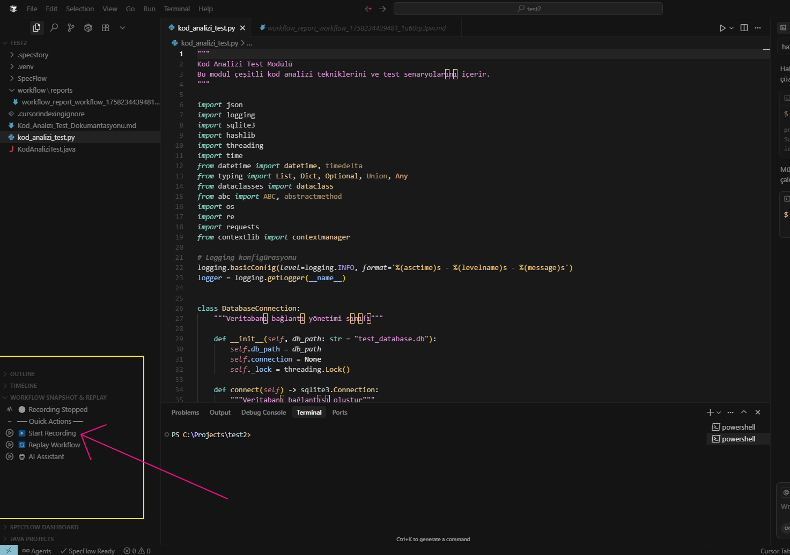

# Workflow Snapshot & Replay - AI-Native Development Workflow Extension

<div align="center">


[](https://marketplace.visualstudio.com/vscode)
[](https://cursor.sh/)
[](https://github.com/workflow-tools)

**Revolutionizing development workflow documentation with AI-powered recording and replay capabilities**

[Quick Start](#quick-start) • [Documentation](#documentation) • [Contributing](#contributing) • [Community](#community)

## Screenshots

<div align="center">

### Workflow Dashboard
*Real-time workflow tracking with Explorer panel integration*


*Real-time workflow tracking with Explorer panel integration*

### AI-Powered Analysis
*Native AI providing workflow optimization suggestions*


*AI Assistant with local model and automatic analysis enabled by default*

### Replay Experience
*Automated workflow reproduction across different environments*


*Coming Soon: Replay demonstration screenshot will be added*

</div>

</div>

## What is Workflow Snapshot & Replay?

Imagine having a **smart assistant** that watches how you code, learns from your development patterns, and helps you become more productive. That's exactly what Workflow Snapshot & Replay does!

### The Problem We Solve

- **Lost Development Knowledge**: How did you build that feature last month? 
- **Inefficient Workflows**: Repeating the same mistakes without realizing
- **Knowledge Sharing**: Difficulty showing teammates your development process
- **Learning Curve**: New developers struggling to understand project workflows

### Our Solution

**Workflow Snapshot & Replay** automatically:
1. **Records** every action you take while coding
2. **Analyzes** your workflow with advanced AI
3. **Documents** your process in beautiful Markdown reports
4. **Replays** your workflow on any machine, anytime


## Key Features

###  Automatic Workflow Recording
- **Zero Setup**: Just click "Start Recording" and work normally
- **Complete Capture**: Files, edits, terminal commands, everything
- **Smart Filtering**: Only captures meaningful development activities
- **Background Operation**: Never interrupts your flow

###  Advanced AI Analysis (No API Key Required!)

#### File-Level Deep Analysis
- **Code Quality Scoring**: Each file gets a quality score (0-100)
- **Pattern Recognition**: Detects programming patterns and architectures
- **Function Analysis**: Identifies functions, imports, and code structure
- **Language Detection**: Automatically recognizes 15+ programming languages

#### Project-Level Intelligence
- **Project Type Detection**: React, Python, Java, .NET projects
- **Architecture Analysis**: MVC, Component-Service, Monolithic patterns
- **Framework Recognition**: Django, Express, Spring Boot, and more
- **Best Practice Recommendations**: Tailored to your tech stack

#### Real-Time Insights
```
Example AI Analysis:
 Project Type: Python Data Analysis Project
 Architecture: Script-based with modular functions
 Files Analyzed:
  • data_analyzer.py: Quality 85/100, Functions: analyze_data, generate_plot
  • requirements.txt: Dependency management, Suggestion: Pin versions
  • README.md: Documentation, Quality 70/100
  Recommendations:
  • Add error handling for HTTP requests
  • Setup virtual environment
  • Consider adding unit tests
```

###  Beautiful Documentation
- **Markdown Reports**: Professional, shareable documentation
- **Timeline View**: Step-by-step development process
- **Visual Insights**: Charts and metrics about your workflow
- **Export Options**: Share with team or save for later

###  Intelligent Replay
- **Cross-Platform**: Record on Windows, replay on Mac/Linux
- **Smart Reproduction**: Automatically recreates files, folders, commands
- **Educational Tool**: Perfect for tutorials and onboarding
- **Debugging Aid**: Reproduce bugs exactly as they occurred

###  Seamless Integration
- **Explorer Dashboard**: Control everything from VS Code's Explorer panel
- **One-Click Actions**: Start, stop, analyze, replay with single clicks
- **Command Palette**: Full keyboard shortcut support
- **No Context Switching**: Everything happens within your editor

## How It Works

### Step 1: Record Your Workflow
```
1. Open your project in VS Code/Cursor
2. Find "Workflow Snapshot & Replay" in Explorer panel
3. Click "▶️ Start Recording"
4. Code normally - create files, edit code, run commands
5. Click "⏹️ Stop Recording" when done
```

### Step 2: Get AI Analysis
```
1. Click "🤖 AI Assistant" in the dashboard
2. Choose your analysis type:
   • "Analyze Current Workflow" - Deep file and project analysis
   • "Get Development Suggestions" - Personalized recommendations
   • "Optimize Workflow" - Find inefficiencies and improvements
   • "Explain Workflow" - Understand what you accomplished
```

### Step 3: Share and Replay
```
1. Click "📋 Generate Report" for beautiful Markdown documentation
2. Share the report with your team or save for reference
3. Use "🔄 Replay Workflow" to reproduce the same steps anywhere
4. Perfect for tutorials, debugging, or onboarding new developers
```

## AI Analysis Examples

### For a React Project:
```
 Analysis Results:
• Project Type: React Frontend Project
• Architecture: Component-Service Architecture
• Languages: TypeScript, CSS, Markdown
• App.tsx: Quality 92/100, Functions: useState, useEffect
  └ Patterns: React Hooks, Component Architecture
• UserService.js: Quality 88/100, Functions: fetchUser, updateProfile
  └ Patterns: API Integration, Async Programming

 Smart Recommendations:
• App.tsx: Consider using React.memo for performance
• UserService.js: Add error boundaries for API calls
• Project: Setup ESLint and Prettier for consistency
```

### For a Python Data Project:
```
 Analysis Results:
• Project Type: Python Data Analysis Project  
• Architecture: Script-based with modular functions
• Languages: Python, Markdown
• data_processor.py: Quality 78/100, Functions: load_data, clean_data
  └ Patterns: Data Analysis, Scientific Computing
• visualization.py: Quality 85/100, Functions: create_charts, save_plots
  └ Patterns: Data Visualization, Matplotlib Integration

 Smart Recommendations:
• data_processor.py: Add type hints for better documentation
• visualization.py: Consider using Seaborn for better plots
• Project: Add requirements.txt with pinned versions
```

## Quick Start

### Installation
1. **Download**: Get `workflow-snapshot-replay-0.1.0.vsix` from releases
2. **Install**: In VS Code/Cursor → Extensions → "Install from VSIX"
3. **Find Dashboard**: Explorer panel → "Workflow Snapshot & Replay"
4. **Start Recording**: Click "▶️ Start Recording" and begin coding!

### First Workflow
1. **Record**: Create a few files, write some code, run terminal commands
2. **Analyze**: Use AI Assistant to get insights about your workflow
3. **Share**: Generate a beautiful Markdown report
4. **Replay**: Try replaying your workflow in a new folder

## Use Cases

###  Education & Training
- **Code Tutorials**: Record coding sessions for students
- **Best Practices**: Show proper development workflows
- **Onboarding**: Help new team members learn your processes

###  Debugging & Quality
- **Bug Reproduction**: Record exact steps that cause issues
- **Code Reviews**: Share your development process with reviewers
- **Performance Analysis**: Identify slow or inefficient workflows

###  Documentation
- **Process Documentation**: Automatically document how features are built
- **Knowledge Sharing**: Share development knowledge across teams
- **Compliance**: Track development processes for audits

###  Productivity
- **Workflow Optimization**: AI identifies ways to work more efficiently
- **Pattern Learning**: Learn from your most productive sessions
- **Automation**: Convert repetitive workflows into automated scripts

## Why Choose Workflow Snapshot & Replay?

###  **Privacy First**
- All analysis happens locally on your machine
- No data sent to external servers (unless you choose to)
- Your code stays private and secure

###  **AI Without API Keys**
- Advanced AI analysis works offline
- No subscription fees or API costs
- Smart enough to provide real value from day one

###  **Universal Compatibility**
- Works with any programming language
- Compatible with any project structure
- Supports all major frameworks and tools

###  **Professional Quality**
- Enterprise-ready security and privacy
- Beautiful, shareable documentation
- Reliable workflow reproduction

## Support & Community

### Getting Help
- **GitHub Issues**: [Report bugs and feature requests](https://github.com/ArslantasM/workflow-snapshot-replay/issues)
- **Documentation**: See KULLANIM_KILAVUZU.md and KURULUM.md
- **Community**: [GitHub Discussions](https://github.com/ArslantasM/workflow-snapshot-replay/discussions)

### Community Resources
- **GitHub**: [Workflow Snapshot & Replay Repository](https://github.com/ArslantasM/workflow-snapshot-replay)
- **Issues**: [Report bugs and feature requests](https://github.com/ArslantasM/workflow-snapshot-replay/issues)
- **Wiki**: [Advanced usage examples](https://github.com/ArslantasM/workflow-snapshot-replay/wiki)

## License

This project is licensed under the Apache License 2.0 - see the [LICENSE](LICENSE) file for details.

## Acknowledgments

- Inspired by the need for better development workflow documentation
- Built for the AI-native development era
- Powered by the amazing VS Code extension ecosystem
- Thanks to the TypeScript and Node.js communities

## Developer

**Mustafa Barış Arslantaş**
- Made in Turkey 🇹🇷
- Passionate about AI-native development and developer productivity
- Copyright © 2025 Mustafa Barış Arslantaş
- Contact: [GitHub Profile](https://github.com/ArslantasM)

---

<div align="center">

**Made in Turkey for developers who believe in documenting and sharing their workflows**


[Star on GitHub](https://github.com/ArslantasM/workflow-snapshot-replay) • [Report Issues](https://github.com/ArslantasM/workflow-snapshot-replay/issues) • [Contact Developer](https://github.com/ArslantasM)

</div>