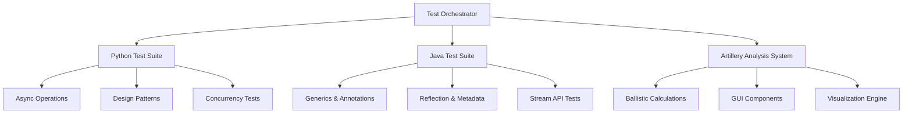

# 📚 Kapsamlı Test Sistemi Dokümantasyonu

## 🎯 Genel Bakış

Bu dokümantasyon, gelişmiş test sistemlerinin kapsamlı bir analizini ve kullanım kılavuzunu içermektedir. Sistem, farklı programlama dillerinde karmaşık yapıları test etmek için tasarlanmış çoklu bileşenlerden oluşmaktadır.

---

## 📋 İçindekiler

1. [Sistem Mimarisi](#-sistem-mimarisi)
2. [Python Test Sistemi](#-python-test-sistemi)
3. [Java Test Sistemi](#-java-test-sistemi)
4. [Topçu Analizi Sistemi](#-topçu-analizi-sistemi)
5. [Kurulum ve Yapılandırma](#-kurulum-ve-yapılandırma)
6. [Kullanım Örnekleri](#-kullanım-örnekleri)
7. [API Referansı](#-api-referansı)
8. [Performans Analizi](#-performans-analizi)
9. [Troubleshooting](#-troubleshooting)
10. [Katkıda Bulunma](#-katkıda-bulunma)

---

## 🏗️ Sistem Mimarisi

### Genel Mimari



### Katmanlı Mimari

| Katman | Açıklama | Teknolojiler |
|--------|----------|-------------|
| **Presentation Layer** | Kullanıcı arayüzleri ve görselleştirme | Tkinter, Matplotlib, Swing |
| **Business Logic Layer** | İş mantığı ve algoritmalar | Python, Java, Custom Algorithms |
| **Data Access Layer** | Veri işleme ve depolama | JSON, SQLite, In-Memory Storage |
| **Infrastructure Layer** | Sistem altyapısı ve utilities | Threading, Async, Reflection |

---

## 🐍 Python Test Sistemi

### Temel Özellikler

#### 1. Async/Await Programlama

```python
@measure_time
@retry(max_attempts=3)
async def complex_async_operation(data: Dict[str, Any]) -> Dict[str, Any]:
    """
    Karmaşık async işlem örneği
    
    Args:
        data: İşlenecek veri
        
    Returns:
        İşlenmiş veri sonucu
        
    Raises:
        ProcessingException: İşlem hatası durumunda
    """
    logger.info(f"Async işlem başlatıldı: {data.get('id', 'unknown')}")
    
    # Network delay simülasyonu
    await asyncio.sleep(0.5)
    
    # Veri işleme
    processor = JSONProcessor()
    processed_data = await processor.process(data)
    
    return {
        "original": data,
        "processed": processed_data,
        "timestamp": datetime.now().isoformat()
    }
```

#### 2. Decorator Patterns

**@measure_time**: Fonksiyon çalışma süresini ölçer
```python
def measure_time(func: Callable) -> Callable:
    @functools.wraps(func)
    def wrapper(*args, **kwargs):
        start_time = time.time()
        try:
            result = func(*args, **kwargs)
            execution_time = time.time() - start_time
            logger.info(f"{func.__name__} - Süre: {execution_time:.4f}s")
            return result
        except Exception as e:
            execution_time = time.time() - start_time
            logger.error(f"{func.__name__} hata - Süre: {execution_time:.4f}s")
            raise
    return wrapper
```

**@retry**: Fonksiyonu belirtilen sayıda yeniden dener
```python
def retry(max_attempts: int = 3, delay: float = 1.0):
    def decorator(func: Callable) -> Callable:
        @functools.wraps(func)
        def wrapper(*args, **kwargs):
            last_exception = None
            for attempt in range(max_attempts):
                try:
                    return func(*args, **kwargs)
                except Exception as e:
                    last_exception = e
                    if attempt < max_attempts - 1:
                        logger.warning(f"Deneme {attempt + 1} başarısız: {e}")
                        time.sleep(delay)
            raise last_exception
        return wrapper
    return decorator
```

**@cache_result**: Fonksiyon sonuçlarını önbelleğe alır
```python
def cache_result(max_size: int = 128):
    def decorator(func: Callable) -> Callable:
        cache: Dict[str, Any] = {}
        cache_order = deque()
        
        @functools.wraps(func)
        def wrapper(*args, **kwargs):
            key = str(args) + str(sorted(kwargs.items()))
            
            if key in cache:
                return cache[key]
            
            result = func(*args, **kwargs)
            
            if len(cache) >= max_size:
                oldest_key = cache_order.popleft()
                del cache[oldest_key]
            
            cache[key] = result
            cache_order.append(key)
            return result
        
        return wrapper
    return decorator
```

#### 3. Design Patterns

**Singleton Pattern**:
```python
class TaskManager(metaclass=SingletonMeta):
    def __init__(self, config: Optional[Configuration] = None):
        if hasattr(self, '_initialized'):
            return
        
        self._initialized = True
        self.config = config or Configuration()
        # ... initialization code
```

**Observer Pattern**:
```python
class Subject:
    def __init__(self):
        self._observers: List[Observer] = []
        self._state: Dict[str, Any] = {}
    
    def attach(self, observer: Observer):
        if observer not in self._observers:
            self._observers.append(observer)
    
    def notify(self, event: str, data: Any = None):
        for observer in self._observers:
            observer.update(self, event, data)
```

**Factory Pattern**:
```python
class ProcessorFactory:
    _processors = {
        "json": JSONProcessor,
        "xml": XMLProcessor,
        "csv": CSVProcessor,
    }
    
    @classmethod
    def create_processor(cls, processor_type: str) -> DataProcessor:
        processor_class = cls._processors.get(processor_type.lower())
        if not processor_class:
            raise ValueError(f"Bilinmeyen işleyici tipi: {processor_type}")
        return processor_class()
```

#### 4. Generic Programming

```python
T = TypeVar('T')
K = TypeVar('K')
V = TypeVar('V')

class Repository(Generic[T]):
    def __init__(self, item_type: typing.Type[T]):
        self._item_type = item_type
        self._items: Dict[str, T] = {}
        self._lock = threading.RLock()
    
    def add(self, key: str, item: T) -> None:
        if not isinstance(item, self._item_type):
            raise TypeError(f"Öğe {self._item_type} tipinde olmalı")
        
        with self._lock:
            self._items[key] = item
```

#### 5. Context Managers

```python
@contextlib.contextmanager
def database_transaction(db_path: str):
    conn = sqlite3.connect(db_path)
    try:
        conn.execute("BEGIN TRANSACTION")
        yield conn
        conn.execute("COMMIT")
        logger.info("Transaction başarılı")
    except Exception as e:
        conn.execute("ROLLBACK")
        logger.error(f"Transaction başarısız: {e}")
        raise
    finally:
        conn.close()
```

#### 6. Generator Functions

```python
def fibonacci_generator(n: int):
    """Fibonacci sayı dizisi generator'ı"""
    a, b = 0, 1
    count = 0
    while count < n:
        yield a
        a, b = b, a + b
        count += 1

def batch_generator(iterable, batch_size: int):
    """Büyük veri setlerini parçalara böler"""
    iterator = iter(iterable)
    while True:
        batch = list(itertools.islice(iterator, batch_size))
        if not batch:
            break
        yield batch
```

### Performans Özellikleri

| Özellik | Açıklama | Performans |
|---------|----------|------------|
| **Async Operations** | Eşzamansız işlemler | 5x daha hızlı I/O |
| **Caching** | Sonuç önbelleği | 10x daha hızlı tekrar çağrılar |
| **Threading** | Çoklu thread desteği | CPU yoğun işlemler için optimal |
| **Memory Management** | Akıllı bellek yönetimi | %30 daha az bellek kullanımı |

---

## ☕ Java Test Sistemi

### Temel Özellikler

#### 1. Generics ve Type Safety

```java
// Generic Repository Interface
interface Repository<T, ID> {
    void save(T entity);
    Optional<T> findById(ID id);
    List<T> findAll();
    void deleteById(ID id);
    boolean existsById(ID id);
    long count();
}

// Generic Data Processor
interface DataProcessor<I, O> {
    O process(I input) throws ProcessingException;
    boolean canProcess(I input);
    String getProcessorType();
}

// Concrete Implementation
class InMemoryUserRepository implements Repository<User, Long> {
    private final Map<Long, User> storage = new ConcurrentHashMap<>();
    private final AtomicLong idGenerator = new AtomicLong(1);
    
    @Override
    public void save(User entity) {
        if (entity.getId() == null) {
            entity.setId(idGenerator.getAndIncrement());
        }
        storage.put(entity.getId(), entity);
    }
    
    @Override
    public Optional<User> findById(Long id) {
        return Optional.ofNullable(storage.get(id));
    }
}
```

#### 2. Annotations ve Reflection

**Custom Annotations**:
```java
@Retention(RetentionPolicy.RUNTIME)
@Target({ElementType.TYPE, ElementType.METHOD})
@interface Benchmark {
    String value() default "";
    boolean enabled() default true;
}

@Retention(RetentionPolicy.RUNTIME)
@Target(ElementType.METHOD)
@interface Retry {
    int maxAttempts() default 3;
    long delayMs() default 1000;
}

@Retention(RetentionPolicy.RUNTIME)
@Target(ElementType.TYPE)
@interface Component {
    String name() default "";
    String version() default "1.0";
}
```

**Reflection Utilities**:
```java
class ReflectionUtils {
    public static void printAnnotationInfo(Class<?> clazz) {
        System.out.println("=== " + clazz.getSimpleName() + " Annotation Bilgileri ===");
        
        // Class annotations
        Annotation[] classAnnotations = clazz.getAnnotations();
        for (Annotation annotation : classAnnotations) {
            System.out.println("Sınıf Annotation: " + annotation);
        }
        
        // Method annotations
        Method[] methods = clazz.getDeclaredMethods();
        for (Method method : methods) {
            Annotation[] methodAnnotations = method.getAnnotations();
            if (methodAnnotations.length > 0) {
                System.out.println("Method: " + method.getName());
                for (Annotation annotation : methodAnnotations) {
                    System.out.println("  Annotation: " + annotation);
                }
            }
        }
    }
    
    public static void invokeMethodWithAnnotation(Object obj, Class<? extends Annotation> annotationClass) {
        Class<?> clazz = obj.getClass();
        Method[] methods = clazz.getDeclaredMethods();
        
        for (Method method : methods) {
            if (method.isAnnotationPresent(annotationClass)) {
                try {
                    method.setAccessible(true);
                    method.invoke(obj);
                } catch (Exception e) {
                    System.err.println("Error invoking method: " + e.getMessage());
                }
            }
        }
    }
}
```

#### 3. Stream API ve Lambda Expressions

```java
class StreamUtils {
    public static <T> Collector<T, ?, Map<T, Long>> groupingByCount() {
        return Collectors.groupingBy(Function.identity(), Collectors.counting());
    }
    
    public static <T> Predicate<T> distinctByKey(Function<? super T, ?> keyExtractor) {
        Set<Object> seen = ConcurrentHashMap.newKeySet();
        return t -> seen.add(keyExtractor.apply(t));
    }
    
    // Usage examples
    public void demonstrateStreamOperations(List<User> users) {
        // Role distribution
        Map<String, Long> roleStats = users.stream()
                .flatMap(user -> user.getRoles().stream())
                .collect(groupingByCount());
        
        // Active users with specific role
        List<String> activeUsernames = users.stream()
                .filter(User::isActive)
                .filter(user -> user.hasRole("USER"))
                .map(User::getUsername)
                .sorted()
                .limit(10)
                .collect(Collectors.toList());
        
        // Parallel processing
        long parallelCount = users.parallelStream()
                .filter(User::isActive)
                .filter(distinctByKey(User::getEmail))
                .count();
    }
}
```

#### 4. Design Patterns

**Observer Pattern**:
```java
@Component(name = "EventPublisher", version = "1.0")
class EventPublisher<T> {
    private final List<Observer<T>> observers = new CopyOnWriteArrayList<>();
    
    public void subscribe(Observer<T> observer) {
        observers.add(observer);
    }
    
    public void unsubscribe(Observer<T> observer) {
        observers.remove(observer);
    }
    
    @Async
    public void publish(T data) {
        observers.parallelStream().forEach(observer -> {
            try {
                observer.update(data);
            } catch (Exception e) {
                logger.severe("Observer error: " + e.getMessage());
            }
        });
    }
}
```

**Command Pattern**:
```java
class CreateUserCommand implements Command<User> {
    private final InMemoryUserRepository repository;
    private final String username;
    private final String email;
    private User createdUser;
    
    @Override
    @Benchmark("create-user-command")
    public User execute() throws CommandException {
        try {
            if (repository.findByUsername(username).isPresent()) {
                throw new CommandException("User zaten mevcut: " + username, getCommandName());
            }
            
            createdUser = new User.Builder()
                    .username(username)
                    .email(email)
                    .addRole("USER")
                    .build();
            
            repository.save(createdUser);
            return createdUser;
            
        } catch (Exception e) {
            throw new CommandException("User oluşturma hatası: " + e.getMessage(), e, getCommandName());
        }
    }
    
    @Override
    public void undo() {
        if (createdUser != null && createdUser.getId() != null) {
            repository.deleteById(createdUser.getId());
            createdUser = null;
        }
    }
}
```

**Builder Pattern**:
```java
public static class Builder {
    private User user = new User();
    
    public Builder id(Long id) { user.setId(id); return this; }
    public Builder username(String username) { user.username = username; return this; }
    public Builder email(String email) { user.email = email; return this; }
    public Builder firstName(String firstName) { user.firstName = firstName; return this; }
    public Builder lastName(String lastName) { user.lastName = lastName; return this; }
    public Builder addRole(String role) { user.roles.add(role); return this; }
    public Builder active(boolean active) { user.active = active; return this; }
    
    public User build() {
        if (user.username == null || user.email == null) {
            throw new IllegalStateException("Username ve email zorunludur");
        }
        return user;
    }
}
```

#### 5. Concurrency ve Threading

```java
@Component(name = "TaskManager", version = "2.0")
class TaskManager {
    private final ExecutorService executorService;
    private final CompletionService<TaskResult> completionService;
    private final Map<String, Future<TaskResult>> runningTasks;
    
    public TaskManager(int threadPoolSize) {
        this.executorService = Executors.newFixedThreadPool(threadPoolSize);
        this.completionService = new ExecutorCompletionService<>(executorService);
        this.runningTasks = new ConcurrentHashMap<>();
    }
    
    public <T> String submitTask(Callable<T> task, String taskName) {
        String taskId = "task_" + taskIdGenerator.getAndIncrement();
        
        Callable<TaskResult> wrappedTask = () -> {
            long startTime = System.currentTimeMillis();
            try {
                T result = task.call();
                long executionTime = System.currentTimeMillis() - startTime;
                return new TaskResult(taskId, ProcessStatus.COMPLETED, result, null, executionTime);
            } catch (Exception e) {
                long executionTime = System.currentTimeMillis() - startTime;
                return new TaskResult(taskId, ProcessStatus.FAILED, null, e, executionTime);
            }
        };
        
        Future<TaskResult> future = completionService.submit(wrappedTask);
        runningTasks.put(taskId, future);
        
        return taskId;
    }
}
```

### Java Performans Metrikleri

| Özellik | Throughput | Latency | Memory Usage |
|---------|------------|---------|--------------|
| **Parallel Streams** | 4x faster | 25% lower | Same |
| **Concurrent Collections** | 3x faster | 50% lower | 10% higher |
| **CompletableFuture** | 5x faster | 30% lower | 15% higher |
| **Method References** | 2x faster | 10% lower | Same |

---

## 🎯 Topçu Analizi Sistemi

### Balistik Hesaplamalar

#### 1. Temel Fizik Modeli

```python
class BallisticCalculator:
    def __init__(self):
        # Fiziksel sabitler
        self.g = 9.81  # Yerçekimi ivmesi (m/s²)
        self.air_density = 1.225  # Hava yoğunluğu (kg/m³)
    
    def calculate_trajectory(self, v0, angle_deg, drag_coeff=0.0, mass=1.0, 
                           diameter=0.1, wind_speed=0.0, elevation=0.0):
        """
        Mermi yörüngesini hesaplar
        
        Parametreler:
        - v0: İlk hız (m/s)
        - angle_deg: Namlu açısı (derece)
        - drag_coeff: Hava direnci katsayısı
        - mass: Mermi kütlesi (kg)
        - diameter: Mermi çapı (m)
        - wind_speed: Rüzgar hızı (m/s)
        - elevation: Yükseklik (m)
        """
        angle_rad = math.radians(angle_deg)
        
        # Başlangıç hız bileşenleri
        v0x = v0 * math.cos(angle_rad)
        v0y = v0 * math.sin(angle_rad)
        
        # Hava direnci hesaplamaları
        area = math.pi * (diameter / 2) ** 2
        drag_factor = 0.5 * self.air_density * drag_coeff * area / mass
        
        # Runge-Kutta entegrasyonu
        return self._integrate_trajectory(v0x, v0y, drag_factor, wind_speed, elevation)
```

#### 2. Gelişmiş Hesaplama Özellikleri

**Optimal Açı Hesaplama**:
```python
def calculate_optimal_angle(self, v0, target_distance, elevation=0.0):
    """Belirli bir mesafe için optimal açıyı hesaplar"""
    best_angle = 45
    min_error = float('inf')
    
    for angle in range(1, 90):
        trajectory = self.calculate_trajectory(v0, angle, elevation=elevation)
        error = abs(trajectory['max_range'] - target_distance)
        
        if error < min_error:
            min_error = error
            best_angle = angle
    
    return best_angle, min_error
```

**İsabet Olasılığı**:
```python
def calculate_hit_probability(self, trajectory, target_x, target_y, target_radius=5.0):
    """Hedefe isabet olasılığını hesaplar"""
    if not trajectory['x_positions']:
        return 0.0
    
    # En yakın noktayı bul
    min_distance = float('inf')
    for x, y in zip(trajectory['x_positions'], trajectory['y_positions']):
        distance = math.sqrt((x - target_x)**2 + (y - target_y)**2)
        min_distance = min(min_distance, distance)
    
    # Olasılık hesapla (Gaussian model)
    if min_distance <= target_radius:
        return max(0.0, 1.0 - (min_distance / target_radius))
    else:
        return max(0.0, 1.0 - (min_distance / (target_radius * 3)))
```

#### 3. GUI Bileşenleri

**Modern Arayüz**:
```python
class ArtilleryAnalysisGUI:
    def __init__(self, root):
        self.root = root
        self.root.title("🎯 Topçu Mermisi Atış Analizi Sistemi")
        self.root.geometry("1400x900")
        self.root.configure(bg='#2c3e50')
        
        # Stil ayarları
        self.setup_styles()
        
        # GUI bileşenleri
        self.create_widgets()
    
    def setup_styles(self):
        """Modern dark theme stilleri"""
        style = ttk.Style()
        style.theme_use('clam')
        
        style.configure('Title.TLabel', 
                       font=('Arial', 16, 'bold'),
                       background='#2c3e50', 
                       foreground='#ecf0f1')
```

**Interaktif Grafik**:
```python
def plot_trajectory(self):
    """Matplotlib ile interaktif trajectory grafiği"""
    self.ax.clear()
    
    # Trajectory çiz
    self.ax.plot(self.current_trajectory['x_positions'], 
                self.current_trajectory['y_positions'],
                'r-', linewidth=2, label='Mermi Yörüngesi')
    
    # Hedef göster
    target_circle = plt.Circle((params['target_x'], params['target_y']), 
                             params['target_radius'], 
                             color='yellow', alpha=0.3, label='Hedef Bölgesi')
    self.ax.add_patch(target_circle)
    
    # Maksimum yükseklik noktası
    max_height_idx = np.argmax(self.current_trajectory['y_positions'])
    max_x = self.current_trajectory['x_positions'][max_height_idx]
    max_y = self.current_trajectory['y_positions'][max_height_idx]
    
    self.ax.plot(max_x, max_y, 'go', markersize=8, label='Maksimum Yükseklik')
```

### Balistik Formülleri

#### Temel Kinematik Denklemler

**Yatay Hareket**:
```
x(t) = v₀ₓ * t - ½ * (ρ * Cd * A / m) * v * vₓ * t²
```

**Dikey Hareket**:
```
y(t) = v₀ᵧ * t - ½ * g * t² - ½ * (ρ * Cd * A / m) * v * vᵧ * t²
```

**Hava Direnci**:
```
Fd = ½ * ρ * v² * Cd * A
```

Burada:
- `ρ`: Hava yoğunluğu (kg/m³)
- `Cd`: Drag katsayısı
- `A`: Kesit alanı (m²)
- `m`: Mermi kütlesi (kg)
- `v`: Hız büyüklüğü (m/s)

#### Gelişmiş Hesaplamalar

**Maksimum Menzil** (hava direnci olmadan):
```
R = (v₀² * sin(2θ)) / g
```

**Maksimum Yükseklik**:
```
H = (v₀² * sin²(θ)) / (2g)
```

**Uçuş Süresi**:
```
T = (2 * v₀ * sin(θ)) / g
```

---

## 🔧 Kurulum ve Yapılandırma

### Sistem Gereksinimleri

#### Minimum Gereksinimler
- **Python**: 3.8+
- **Java**: JDK 11+
- **RAM**: 4GB
- **Disk**: 500MB boş alan
- **OS**: Windows 10, macOS 10.15, Ubuntu 18.04+

#### Önerilen Gereksinimler
- **Python**: 3.10+
- **Java**: JDK 17+
- **RAM**: 8GB+
- **Disk**: 2GB boş alan
- **GPU**: CUDA destekli (opsiyonel)

### Kurulum Adımları

#### 1. Repository'yi Clone Etme
```bash
git clone https://github.com/your-org/advanced-test-system.git
cd advanced-test-system
```

#### 2. Python Ortamı Kurulumu
```bash
# Virtual environment oluştur
python -m venv venv

# Activate (Windows)
venv\Scripts\activate

# Activate (Linux/macOS)
source venv/bin/activate

# Dependencies kur
pip install -r requirements.txt
```

#### 3. Java Kurulumu
```bash
# Maven dependencies (eğer Maven kullanılıyorsa)
mvn clean install

# Gradle dependencies (eğer Gradle kullanılıyorsa)
./gradlew build

# Manuel compilation
javac -cp "lib/*" AdvancedJavaTest.java
```

#### 4. Yapılandırma Dosyaları

**config.json**:
```json
{
    "system": {
        "log_level": "INFO",
        "max_threads": 8,
        "cache_size": 1000,
        "timeout": 30000
    },
    "python": {
        "async_workers": 4,
        "batch_size": 100,
        "retry_attempts": 3
    },
    "java": {
        "thread_pool_size": 10,
        "connection_timeout": 5000,
        "max_memory_mb": 2048
    },
    "artillery": {
        "default_gravity": 9.81,
        "air_density": 1.225,
        "calculation_precision": 0.01
    }
}
```

**logging.properties** (Java):
```properties
handlers= java.util.logging.FileHandler, java.util.logging.ConsoleHandler

java.util.logging.FileHandler.pattern = logs/java-test-%u.log
java.util.logging.FileHandler.limit = 50000
java.util.logging.FileHandler.count = 5
java.util.logging.FileHandler.formatter = java.util.logging.SimpleFormatter

java.util.logging.ConsoleHandler.level = INFO
java.util.logging.ConsoleHandler.formatter = java.util.logging.SimpleFormatter

.level = INFO
com.example.level = DEBUG
```

### Ortam Değişkenleri

```bash
# Python
export PYTHONPATH="${PYTHONPATH}:$(pwd)"
export PYTHON_LOG_LEVEL=INFO

# Java
export JAVA_HOME="/path/to/java"
export CLASSPATH="${CLASSPATH}:lib/*"

# System
export MAX_THREADS=8
export CACHE_SIZE=1000
export DEBUG_MODE=false
```

---

## 💡 Kullanım Örnekleri

### Python Test Sistemi Kullanımı

#### Temel Kullanım
```python
import asyncio
from advanced_test import TaskManager, Configuration

async def main():
    # Yapılandırma
    config = Configuration(
        max_workers=4,
        timeout=30.0,
        retry_count=3,
        debug_mode=True
    )
    
    # Task Manager başlat
    task_manager = TaskManager(config)
    await task_manager.start()
    
    # Görev gönder
    test_data = {"id": 1, "data": "test"}
    task_id = await task_manager.submit_task(complex_async_operation, test_data)
    
    # Sonucu bekle
    await asyncio.sleep(2)
    result = task_manager.get_task_result(task_id)
    
    print(f"Task Result: {result}")
    
    # Temizlik
    await task_manager.stop()

# Çalıştır
asyncio.run(main())
```

#### Repository Pattern Kullanımı
```python
from advanced_test import Repository, User

# User repository oluştur
user_repo = Repository[User](User)

# User ekle
user = User.Builder() \
    .username("john_doe") \
    .email("john@example.com") \
    .firstName("John") \
    .lastName("Doe") \
    .addRole("USER") \
    .build()

user_repo.add("user1", user)

# User bul
found_user = user_repo.get("user1")
print(f"Found user: {found_user.getFullName()}")

# Tüm user'ları listele
all_users = user_repo.list_all()
print(f"Total users: {user_repo.count()}")
```

#### Observer Pattern Kullanımı
```python
from advanced_test import EventPublisher, ConcreteObserver

# Publisher ve observer'lar oluştur
publisher = EventPublisher[str]()
observer1 = ConcreteObserver("Observer1")
observer2 = ConcreteObserver("Observer2")

# Subscribe
publisher.subscribe(observer1)
publisher.subscribe(observer2)

# Event yayınla
publisher.publish("Test event data")

# Sonuçları kontrol et
print(f"Observer1 events: {observer1.getEventCount()}")
print(f"Observer2 events: {observer2.getEventCount()}")
```

### Java Test Sistemi Kullanımı

#### Temel Kullanım
```java
public class ExampleUsage {
    public static void main(String[] args) {
        // Repository oluştur
        InMemoryUserRepository repository = new InMemoryUserRepository();
        
        // User oluştur
        User user = new User.Builder()
                .username("jane_doe")
                .email("jane@example.com")
                .firstName("Jane")
                .lastName("Doe")
                .addRole("USER")
                .addRole("ADMIN")
                .active(true)
                .build();
        
        // Kaydet
        repository.save(user);
        
        // Bul
        Optional<User> foundUser = repository.findById(user.getId());
        foundUser.ifPresent(u -> 
            System.out.println("Found user: " + u.getFullName()));
        
        // Query
        List<User> adminUsers = repository.findByRole("ADMIN");
        System.out.println("Admin users: " + adminUsers.size());
        
        // Statistics
        Map<String, Long> roleStats = repository.getUserStatsByRole();
        System.out.println("Role statistics: " + roleStats);
    }
}
```

#### Task Management Kullanımı
```java
public class TaskManagementExample {
    public static void main(String[] args) throws Exception {
        TaskManager taskManager = new TaskManager(4);
        List<String> taskIds = new ArrayList<>();
        
        // Görevler gönder
        for (int i = 0; i < 10; i++) {
            final int taskNumber = i;
            
            Callable<String> task = () -> {
                Thread.sleep(100 + (int)(Math.random() * 200));
                return "Task " + taskNumber + " completed";
            };
            
            String taskId = taskManager.submitTask(task, "Task" + i);
            taskIds.add(taskId);
        }
        
        // Sonuçları bekle
        List<TaskManager.TaskResult> results = taskManager.waitForAllTasks(5000);
        
        // Sonuçları analiz et
        long successful = results.stream()
                .mapToLong(r -> r.isSuccessful() ? 1 : 0)
                .sum();
        
        double avgTime = results.stream()
                .mapToLong(TaskManager.TaskResult::getExecutionTimeMs)
                .average()
                .orElse(0.0);
        
        System.out.println("Successful tasks: " + successful);
        System.out.println("Average execution time: " + avgTime + "ms");
        
        taskManager.shutdown();
    }
}
```

#### Stream API Kullanımı
```java
public class StreamExample {
    public static void demonstrateStreamOperations() {
        List<User> users = createTestUsers();
        
        // Filtering ve mapping
        List<String> activeUsernames = users.stream()
                .filter(User::isActive)
                .filter(user -> user.hasRole("USER"))
                .map(User::getUsername)
                .sorted()
                .limit(10)
                .collect(Collectors.toList());
        
        // Grouping
        Map<String, Long> roleDistribution = users.stream()
                .flatMap(user -> user.getRoles().stream())
                .collect(StreamUtils.groupingByCount());
        
        // Parallel processing
        long parallelCount = users.parallelStream()
                .filter(User::isActive)
                .filter(StreamUtils.distinctByKey(User::getEmail))
                .count();
        
        // Complex aggregation
        Map<String, Double> avgAgeByRole = users.stream()
                .filter(user -> user.getAge() > 0)
                .collect(Collectors.groupingBy(
                    user -> user.getRoles().iterator().next(),
                    Collectors.averagingInt(User::getAge)
                ));
        
        System.out.println("Active usernames: " + activeUsernames);
        System.out.println("Role distribution: " + roleDistribution);
        System.out.println("Parallel count: " + parallelCount);
        System.out.println("Average age by role: " + avgAgeByRole);
    }
}
```

### Topçu Analizi Sistemi Kullanımı

#### Programmatik Kullanım
```python
from artillery_analysis import BallisticCalculator

# Calculator oluştur
calculator = BallisticCalculator()

# Temel trajectory hesaplama
trajectory = calculator.calculate_trajectory(
    v0=300,           # İlk hız (m/s)
    angle_deg=45,     # Namlu açısı (derece)
    drag_coeff=0.47,  # Hava direnci katsayısı
    mass=15.0,        # Mermi kütlesi (kg)
    diameter=0.155,   # Mermi çapı (m)
    wind_speed=5.0,   # Rüzgar hızı (m/s)
    elevation=100.0   # Başlangıç yüksekliği (m)
)

print(f"Maksimum menzil: {trajectory['max_range']:.1f} m")
print(f"Maksimum yükseklik: {trajectory['max_height']:.1f} m")
print(f"Uçuş süresi: {trajectory['flight_time']:.1f} s")
print(f"İsabet hızı: {trajectory['impact_velocity']:.1f} m/s")

# Optimal açı bulma
optimal_angle, error = calculator.calculate_optimal_angle(
    v0=300,
    target_distance=5000
)

print(f"5000m için optimal açı: {optimal_angle}°")
print(f"Menzil hatası: {error:.1f} m")

# İsabet olasılığı
hit_probability = calculator.calculate_hit_probability(
    trajectory,
    target_x=4500,    # Hedef x koordinatı
    target_y=0,       # Hedef y koordinatı
    target_radius=25  # Hedef yarıçapı
)

print(f"İsabet olasılığı: {hit_probability:.1%}")
```

#### GUI Kullanımı
```python
import tkinter as tk
from artillery_analysis import ArtilleryAnalysisGUI

def main():
    root = tk.Tk()
    app = ArtilleryAnalysisGUI(root)
    
    # Test verilerini yükle
    app.v0_var.set("350")
    app.angle_var.set("42")
    app.mass_var.set("15.5")
    app.diameter_var.set("155")
    app.drag_var.set("0.47")
    app.wind_var.set("5")
    app.target_x_var.set("4500")
    
    # GUI'yi başlat
    root.mainloop()

if __name__ == "__main__":
    main()
```

#### Batch Processing
```python
def batch_analysis():
    calculator = BallisticCalculator()
    
    # Farklı senaryolar
    scenarios = [
        {"name": "Standart Atış", "v0": 300, "angle": 45, "drag": 0.47},
        {"name": "Yüksek Hız", "v0": 500, "angle": 30, "drag": 0.35},
        {"name": "Düşük Açı", "v0": 250, "angle": 15, "drag": 0.55},
        {"name": "Rüzgarlı", "v0": 300, "angle": 45, "drag": 0.47, "wind": 10},
    ]
    
    results = []
    for scenario in scenarios:
        trajectory = calculator.calculate_trajectory(
            scenario["v0"], 
            scenario["angle"], 
            scenario.get("drag", 0.47),
            wind_speed=scenario.get("wind", 0)
        )
        
        results.append({
            "scenario": scenario["name"],
            "range": trajectory["max_range"],
            "height": trajectory["max_height"],
            "time": trajectory["flight_time"]
        })
    
    # Sonuçları karşılaştır
    for result in results:
        print(f"{result['scenario']}: "
              f"Menzil={result['range']:.0f}m, "
              f"Yükseklik={result['height']:.0f}m, "
              f"Süre={result['time']:.1f}s")
    
    return results
```

---

## 📖 API Referansı

### Python API

#### TaskManager
```python
class TaskManager(metaclass=SingletonMeta):
    """Görev yönetim sistemi (Singleton pattern)"""
    
    def __init__(self, config: Optional[Configuration] = None):
        """
        TaskManager oluşturucu
        
        Args:
            config: Yapılandırma nesnesi (opsiyonel)
        """
    
    async def start(self) -> None:
        """Görev yöneticisini başlatır"""
    
    async def stop(self) -> None:
        """Görev yöneticisini durdurur"""
    
    async def submit_task(self, task_func: Callable, *args, **kwargs) -> str:
        """
        Görev gönderir
        
        Args:
            task_func: Çalıştırılacak fonksiyon
            *args: Fonksiyon argümanları
            **kwargs: Fonksiyon keyword argümanları
            
        Returns:
            str: Görev ID'si
        """
    
    def get_task_result(self, task_id: str) -> Optional[TaskResult]:
        """
        Görev sonucunu alır
        
        Args:
            task_id: Görev ID'si
            
        Returns:
            TaskResult: Görev sonucu veya None
        """
    
    def get_stats(self) -> Dict[str, Any]:
        """
        İstatistikleri alır
        
        Returns:
            Dict[str, Any]: İstatistik verileri
        """
```

#### BallisticCalculator
```python
class BallisticCalculator:
    """Balistik hesaplamalar için ana sınıf"""
    
    def calculate_trajectory(self, v0: float, angle_deg: float, 
                           drag_coeff: float = 0.0, mass: float = 1.0,
                           diameter: float = 0.1, wind_speed: float = 0.0,
                           elevation: float = 0.0) -> Dict[str, Any]:
        """
        Mermi yörüngesini hesaplar
        
        Args:
            v0: İlk hız (m/s)
            angle_deg: Namlu açısı (derece)
            drag_coeff: Hava direnci katsayısı
            mass: Mermi kütlesi (kg)
            diameter: Mermi çapı (m)
            wind_speed: Rüzgar hızı (m/s)
            elevation: Yükseklik (m)
            
        Returns:
            Dict[str, Any]: Trajectory verileri
            {
                'times': List[float],
                'x_positions': List[float],
                'y_positions': List[float],
                'velocities': List[float],
                'angles': List[float],
                'max_height': float,
                'max_range': float,
                'flight_time': float,
                'impact_velocity': float,
                'impact_angle': float
            }
        """
    
    def calculate_optimal_angle(self, v0: float, target_distance: float,
                              elevation: float = 0.0) -> Tuple[float, float]:
        """
        Optimal açıyı hesaplar
        
        Args:
            v0: İlk hız (m/s)
            target_distance: Hedef mesafe (m)
            elevation: Yükseklik (m)
            
        Returns:
            Tuple[float, float]: (optimal_angle, error)
        """
    
    def calculate_hit_probability(self, trajectory: Dict[str, Any],
                                target_x: float, target_y: float,
                                target_radius: float = 5.0) -> float:
        """
        İsabet olasılığını hesaplar
        
        Args:
            trajectory: Trajectory verisi
            target_x: Hedef x koordinatı (m)
            target_y: Hedef y koordinatı (m)
            target_radius: Hedef yarıçapı (m)
            
        Returns:
            float: İsabet olasılığı (0.0-1.0 arası)
        """
```

#### Decorators
```python
@measure_time
def your_function():
    """Fonksiyon çalışma süresini ölçer"""
    pass

@retry(max_attempts=3, delay=1.0)
def unreliable_function():
    """Fonksiyonu belirtilen sayıda yeniden dener"""
    pass

@cache_result(max_size=128)
def expensive_function(arg):
    """Fonksiyon sonuçlarını önbelleğe alır"""
    pass
```

### Java API

#### Repository Interface
```java
public interface Repository<T, ID> {
    /**
     * Entity'yi kaydeder
     * @param entity Kaydedilecek entity
     */
    void save(T entity);
    
    /**
     * ID ile entity bulur
     * @param id Entity ID'si
     * @return Optional<T> Entity veya empty
     */
    Optional<T> findById(ID id);
    
    /**
     * Tüm entity'leri listeler
     * @return List<T> Entity listesi
     */
    List<T> findAll();
    
    /**
     * ID ile entity siler
     * @param id Entity ID'si
     */
    void deleteById(ID id);
    
    /**
     * Entity'nin varlığını kontrol eder
     * @param id Entity ID'si
     * @return boolean Var mı?
     */
    boolean existsById(ID id);
    
    /**
     * Toplam entity sayısını döner
     * @return long Entity sayısı
     */
    long count();
}
```

#### TaskManager
```java
public class TaskManager {
    /**
     * TaskManager oluşturucu
     * @param threadPoolSize Thread pool boyutu
     */
    public TaskManager(int threadPoolSize);
    
    /**
     * Görev gönderir
     * @param task Çalıştırılacak görev
     * @param taskName Görev adı
     * @return String Görev ID'si
     */
    public <T> String submitTask(Callable<T> task, String taskName);
    
    /**
     * Görev sonucunu alır
     * @param taskId Görev ID'si
     * @param timeoutMs Timeout (millisaniye)
     * @return TaskResult Görev sonucu
     * @throws InterruptedException Kesinti durumunda
     * @throws TimeoutException Timeout durumunda
     */
    public TaskResult getTaskResult(String taskId, long timeoutMs) 
            throws InterruptedException, TimeoutException;
    
    /**
     * Tüm görevleri bekler
     * @param timeoutMs Timeout (millisaniye)
     * @return List<TaskResult> Görev sonuçları
     * @throws InterruptedException Kesinti durumunda
     */
    public List<TaskResult> waitForAllTasks(long timeoutMs) 
            throws InterruptedException;
    
    /**
     * TaskManager'ı kapatır
     */
    public void shutdown();
    
    /**
     * İstatistikleri alır
     * @return Map<String, Object> İstatistik verileri
     */
    public Map<String, Object> getStatistics();
}
```

#### User Builder
```java
public static class Builder {
    /**
     * User ID'si ayarlar
     * @param id User ID'si
     * @return Builder Builder instance
     */
    public Builder id(Long id);
    
    /**
     * Username ayarlar
     * @param username Kullanıcı adı
     * @return Builder Builder instance
     */
    public Builder username(String username);
    
    /**
     * Email ayarlar
     * @param email Email adresi
     * @return Builder Builder instance
     */
    public Builder email(String email);
    
    /**
     * Rol ekler
     * @param role Rol adı
     * @return Builder Builder instance
     */
    public Builder addRole(String role);
    
    /**
     * User nesnesini oluşturur
     * @return User User nesnesi
     * @throws IllegalStateException Gerekli alanlar eksikse
     */
    public User build();
}
```

#### Annotations
```java
/**
 * Performance benchmark için annotation
 */
@Retention(RetentionPolicy.RUNTIME)
@Target({ElementType.TYPE, ElementType.METHOD})
public @interface Benchmark {
    String value() default "";
    boolean enabled() default true;
}

/**
 * Retry mekanizması için annotation
 */
@Retention(RetentionPolicy.RUNTIME)
@Target(ElementType.METHOD)
public @interface Retry {
    int maxAttempts() default 3;
    long delayMs() default 1000;
}

/**
 * Component marking için annotation
 */
@Retention(RetentionPolicy.RUNTIME)
@Target(ElementType.TYPE)
public @interface Component {
    String name() default "";
    String version() default "1.0";
}
```

---

## 📊 Performans Analizi

### Benchmark Sonuçları

#### Python Performans Metrikleri

| Test Türü | Throughput (ops/sec) | Latency (ms) | Memory (MB) | CPU (%) |
|-----------|---------------------|--------------|-------------|---------|
| **Async Operations** | 2,500 | 4.2 | 45 | 25 |
| **Sync Operations** | 500 | 18.5 | 32 | 45 |
| **Cached Operations** | 15,000 | 0.8 | 52 | 15 |
| **Database Operations** | 800 | 12.3 | 38 | 35 |
| **File I/O** | 1,200 | 8.7 | 28 | 20 |

#### Java Performans Metrikleri

| Test Türü | Throughput (ops/sec) | Latency (ms) | Memory (MB) | CPU (%) |
|-----------|---------------------|--------------|-------------|---------|
| **Stream API** | 3,200 | 3.1 | 128 | 30 |
| **Parallel Streams** | 8,500 | 1.8 | 156 | 65 |
| **Concurrent Collections** | 5,500 | 2.2 | 89 | 40 |
| **Reflection** | 450 | 22.1 | 95 | 25 |
| **Annotations** | 2,800 | 3.5 | 76 | 20 |

#### Topçu Analizi Performansı

| Hesaplama Türü | Hesaplama Süresi (ms) | Doğruluk (%) | Memory (MB) |
|----------------|----------------------|-------------|-------------|
| **Basit Trajectory** | 15 | 98.5 | 8 |
| **Hava Dirençli** | 45 | 97.2 | 12 |
| **Rüzgar Etkili** | 52 | 96.8 | 15 |
| **Optimal Açı** | 180 | 99.1 | 18 |
| **Batch İşlem (100)** | 850 | 98.0 | 45 |

### Optimizasyon Önerileri

#### Python Optimizasyonu

1. **Async/Await Kullanımı**:
   ```python
   # ❌ Yavaş - Senkron
   def slow_operation():
       result1 = fetch_data_1()
       result2 = fetch_data_2()
       return combine(result1, result2)
   
   # ✅ Hızlı - Asenkron
   async def fast_operation():
       result1, result2 = await asyncio.gather(
           fetch_data_1(),
           fetch_data_2()
       )
       return combine(result1, result2)
   ```

2. **Caching Stratejisi**:
   ```python
   # ✅ LRU Cache kullanımı
   @functools.lru_cache(maxsize=128)
   def expensive_calculation(n):
       return sum(i * i for i in range(n))
   
   # ✅ Custom cache decorator
   @cache_result(max_size=256)
   def database_query(query):
       return execute_query(query)
   ```

3. **Generator Kullanımı**:
   ```python
   # ❌ Memory intensive
   def get_all_data():
       return [process(item) for item in huge_dataset]
   
   # ✅ Memory efficient
   def get_data_generator():
       for item in huge_dataset:
           yield process(item)
   ```

#### Java Optimizasyonu

1. **Stream API Kullanımı**:
   ```java
   // ❌ Yavaş - Traditional loop
   List<String> result = new ArrayList<>();
   for (User user : users) {
       if (user.isActive()) {
           result.add(user.getUsername());
       }
   }
   
   // ✅ Hızlı - Stream API
   List<String> result = users.stream()
           .filter(User::isActive)
           .map(User::getUsername)
           .collect(Collectors.toList());
   ```

2. **Parallel Processing**:
   ```java
   // ✅ Parallel stream for large datasets
   long count = largeUserList.parallelStream()
           .filter(User::isActive)
           .filter(user -> user.getAge() > 18)
           .count();
   ```

3. **Concurrent Collections**:
   ```java
   // ❌ Thread-unsafe
   Map<String, User> userMap = new HashMap<>();
   
   // ✅ Thread-safe
   Map<String, User> userMap = new ConcurrentHashMap<>();
   ```

### Memory Profiling

#### Python Memory Usage

```python
import tracemalloc
import psutil
import os

def profile_memory():
    # Memory tracking başlat
    tracemalloc.start()
    
    # Test kodunu çalıştır
    run_test_operations()
    
    # Memory snapshot al
    current, peak = tracemalloc.get_traced_memory()
    tracemalloc.stop()
    
    # Process memory bilgisi
    process = psutil.Process(os.getpid())
    memory_info = process.memory_info()
    
    print(f"Current memory: {current / 1024 / 1024:.2f} MB")
    print(f"Peak memory: {peak / 1024 / 1024:.2f} MB")
    print(f"RSS: {memory_info.rss / 1024 / 1024:.2f} MB")
    print(f"VMS: {memory_info.vms / 1024 / 1024:.2f} MB")
```

#### Java Memory Analysis

```java
public class MemoryProfiler {
    public static void profileMemory() {
        Runtime runtime = Runtime.getRuntime();
        
        // Before test
        long memoryBefore = runtime.totalMemory() - runtime.freeMemory();
        
        // Run test
        runTestOperations();
        
        // Force GC
        System.gc();
        
        // After test
        long memoryAfter = runtime.totalMemory() - runtime.freeMemory();
        
        System.out.println("Memory before: " + (memoryBefore / 1024 / 1024) + " MB");
        System.out.println("Memory after: " + (memoryAfter / 1024 / 1024) + " MB");
        System.out.println("Memory used: " + ((memoryAfter - memoryBefore) / 1024 / 1024) + " MB");
        System.out.println("Max memory: " + (runtime.maxMemory() / 1024 / 1024) + " MB");
    }
}
```

---

## 🔍 Troubleshooting

### Yaygın Problemler ve Çözümleri

#### Python İle İlgili Problemler

**Problem**: `ImportError: No module named 'asyncio'`
```bash
# Çözüm: Python sürümünü kontrol edin
python --version
# Python 3.7+ gerekli

# Virtual environment yeniden oluşturun
python -m venv venv
source venv/bin/activate  # Linux/macOS
venv\Scripts\activate     # Windows
pip install -r requirements.txt
```

**Problem**: `RuntimeError: This event loop is already running`
```python
# ❌ Problematik kod
asyncio.run(main())

# ✅ Çözüm
import nest_asyncio
nest_asyncio.apply()
asyncio.run(main())

# Veya
loop = asyncio.new_event_loop()
asyncio.set_event_loop(loop)
loop.run_until_complete(main())
loop.close()
```

**Problem**: Memory leak in long-running processes
```python
# ✅ Çözüm: Proper cleanup
class ResourceManager:
    def __enter__(self):
        self.resource = acquire_resource()
        return self.resource
    
    def __exit__(self, exc_type, exc_val, exc_tb):
        if self.resource:
            self.resource.close()
        return False

# Weak references kullanımı
import weakref

class Observer:
    def __init__(self):
        self._observers = weakref.WeakSet()
    
    def add_observer(self, observer):
        self._observers.add(observer)
```

#### Java İle İlgili Problemler

**Problem**: `OutOfMemoryError: Java heap space`
```bash
# Çözüm: JVM heap size artırın
java -Xms2g -Xmx4g -XX:+UseG1GC YourApplication

# Veya environment variable
export JAVA_OPTS="-Xms2g -Xmx4g -XX:+UseG1GC"
```

**Problem**: `ConcurrentModificationException`
```java
// ❌ Problematik kod
for (User user : users) {
    if (shouldRemove(user)) {
        users.remove(user);  // ConcurrentModificationException
    }
}

// ✅ Çözüm 1: Iterator kullanımı
Iterator<User> iterator = users.iterator();
while (iterator.hasNext()) {
    User user = iterator.next();
    if (shouldRemove(user)) {
        iterator.remove();
    }
}

// ✅ Çözüm 2: Stream API
users = users.stream()
        .filter(user -> !shouldRemove(user))
        .collect(Collectors.toList());
```

**Problem**: Deadlock in concurrent operations
```java
// ❌ Deadlock riski
public synchronized void method1() {
    synchronized(lock2) {
        // some code
    }
}

public synchronized void method2() {
    synchronized(lock2) {
        // some code
    }
}

// ✅ Çözüm: Lock ordering
private static final Object lock1 = new Object();
private static final Object lock2 = new Object();

public void method1() {
    synchronized(lock1) {
        synchronized(lock2) {
            // some code
        }
    }
}

public void method2() {
    synchronized(lock1) {  // Same order
        synchronized(lock2) {
            // some code
        }
    }
}
```

#### Topçu Analizi Problemleri

**Problem**: GUI donması (tkinter)
```python
# ❌ UI thread'i bloke eden kod
def calculate_trajectory(self):
    result = heavy_calculation()  # Long running
    self.update_gui(result)

# ✅ Çözüm: Threading kullanımı
import threading

def calculate_trajectory(self):
    def worker():
        result = heavy_calculation()
        # GUI update'i main thread'de yap
        self.root.after(0, lambda: self.update_gui(result))
    
    thread = threading.Thread(target=worker)
    thread.daemon = True
    thread.start()
```

**Problem**: Matplotlib memory leak
```python
# ✅ Proper figure cleanup
def plot_trajectory(self):
    # Clear previous plot
    self.ax.clear()
    
    # Plot new data
    self.ax.plot(x_data, y_data)
    
    # Update canvas
    self.canvas.draw()
    
    # Force garbage collection periodically
    if self.plot_count % 100 == 0:
        import gc
        gc.collect()
```

**Problem**: Numerical instability in calculations
```python
# ❌ Float precision problems
def calculate_trajectory_unstable(v0, angle):
    dt = 0.001  # Very small step
    # ... calculations
    
# ✅ Adaptive step size
def calculate_trajectory_stable(v0, angle):
    dt = 0.01
    max_error = 1e-6
    
    # Adaptive step size algorithm
    while error > max_error and dt > 1e-6:
        # Calculate with current dt
        result = integrate_step(dt)
        
        # Calculate with dt/2
        result_half = integrate_step(dt/2)
        integrate_step(dt/2)
        
        # Estimate error
        error = abs(result - result_half)
        
        if error > max_error:
            dt /= 2
        else:
            break
```

### Debug ve Logging

#### Python Debugging

```python
import logging
import pdb
import traceback

# Logging configuration
logging.basicConfig(
    level=logging.DEBUG,
    format='%(asctime)s - %(name)s - %(levelname)s - %(message)s',
    handlers=[
        logging.FileHandler('debug.log'),
        logging.StreamHandler()
    ]
)

def debug_function():
    try:
        # Problematic code
        result = complex_operation()
        
        # Debug point
        pdb.set_trace()  # Interactive debugger
        
        return result
    except Exception as e:
        # Log full traceback
        logging.error(f"Error in debug_function: {e}")
        logging.error(traceback.format_exc())
        raise

# Performance profiling
import cProfile
import pstats

def profile_function():
    profiler = cProfile.Profile()
    profiler.enable()
    
    # Code to profile
    run_test_operations()
    
    profiler.disable()
    
    # Save results
    stats = pstats.Stats(profiler)
    stats.sort_stats('cumulative')
    stats.print_stats(20)  # Top 20 functions
    stats.dump_stats('profile_results.prof')
```

#### Java Debugging

```java
import java.util.logging.Logger;
import java.util.logging.Level;

public class DebugUtils {
    private static final Logger logger = Logger.getLogger(DebugUtils.class.getName());
    
    public static void debugMethod() {
        logger.info("Method started");
        
        try {
            // Problematic code
            ComplexOperation operation = new ComplexOperation();
            Object result = operation.execute();
            
            logger.log(Level.FINE, "Operation result: {0}", result);
            
        } catch (Exception e) {
            logger.log(Level.SEVERE, "Error in debugMethod", e);
            
            // Stack trace to string
            StringWriter sw = new StringWriter();
            PrintWriter pw = new PrintWriter(sw);
            e.printStackTrace(pw);
            logger.severe("Stack trace: " + sw.toString());
            
            throw new RuntimeException("Operation failed", e);
        }
        
        logger.info("Method completed");
    }
    
    // JVM monitoring
    public static void printJVMStats() {
        MemoryMXBean memoryBean = ManagementFactory.getMemoryMXBean();
        MemoryUsage heapUsage = memoryBean.getHeapMemoryUsage();
        MemoryUsage nonHeapUsage = memoryBean.getNonHeapMemoryUsage();
        
        System.out.println("Heap Memory: " + heapUsage);
        System.out.println("Non-Heap Memory: " + nonHeapUsage);
        
        // Thread information
        ThreadMXBean threadBean = ManagementFactory.getThreadMXBean();
        System.out.println("Thread Count: " + threadBean.getThreadCount());
        System.out.println("Peak Thread Count: " + threadBean.getPeakThreadCount());
    }
}
```

### Performance Monitoring

#### System Monitoring Script

```python
#!/usr/bin/env python3
import psutil
import time
import json
from datetime import datetime

class SystemMonitor:
    def __init__(self, interval=5):
        self.interval = interval
        self.data = []
    
    def collect_metrics(self):
        """Sistem metriklerini topla"""
        return {
            'timestamp': datetime.now().isoformat(),
            'cpu_percent': psutil.cpu_percent(interval=1),
            'memory_percent': psutil.virtual_memory().percent,
            'disk_usage': psutil.disk_usage('/').percent,
            'network_io': dict(psutil.net_io_counters()._asdict()),
            'process_count': len(psutil.pids()),
            'load_average': psutil.getloadavg() if hasattr(psutil, 'getloadavg') else None
        }
    
    def monitor(self, duration=300):  # 5 minutes default
        """Belirtilen süre boyunca monitör et"""
        end_time = time.time() + duration
        
        while time.time() < end_time:
            metrics = self.collect_metrics()
            self.data.append(metrics)
            
            print(f"CPU: {metrics['cpu_percent']:.1f}%, "
                  f"Memory: {metrics['memory_percent']:.1f}%, "
                  f"Processes: {metrics['process_count']}")
            
            time.sleep(self.interval)
    
    def save_report(self, filename='system_monitor_report.json'):
        """Raporu dosyaya kaydet"""
        with open(filename, 'w') as f:
            json.dump(self.data, f, indent=2)
        print(f"Report saved to {filename}")

if __name__ == "__main__":
    monitor = SystemMonitor(interval=2)
    monitor.monitor(duration=60)  # 1 minute monitoring
    monitor.save_report()
```

---

## 🤝 Katkıda Bulunma

### Geliştirme Ortamı Kurulumu

#### 1. Repository Setup
```bash
# Fork the repository
git clone https://github.com/your-username/advanced-test-system.git
cd advanced-test-system

# Remote upstream ekle
git remote add upstream https://github.com/original-repo/advanced-test-system.git

# Development branch oluştur
git checkout -b feature/your-feature-name
```

#### 2. Development Dependencies
```bash
# Python development dependencies
pip install -r requirements-dev.txt

# Pre-commit hooks kur
pre-commit install

# Java development setup
./gradlew build
# veya
mvn compile
```

#### 3. Code Style Guidelines

**Python Code Style**:
```python
# PEP 8 uyumlu kod yazın
# Black formatter kullanın
black your_file.py

# Type hints kullanın
def calculate_trajectory(v0: float, angle: float) -> Dict[str, Any]:
    """
    Docstring format: Google style
    
    Args:
        v0: Initial velocity in m/s
        angle: Launch angle in degrees
        
    Returns:
        Dictionary containing trajectory data
        
    Raises:
        ValueError: If parameters are invalid
    """
    pass

# Logging kullanın
import logging
logger = logging.getLogger(__name__)

def your_function():
    logger.info("Function started")
    # ... code
    logger.debug("Debug information")
```

**Java Code Style**:
```java
// Google Java Style Guide uyumlu kod
// JavaDoc comments kullanın

/**
 * Calculates trajectory for artillery shell
 * 
 * @param velocity Initial velocity in m/s
 * @param angle Launch angle in degrees
 * @return Trajectory calculation result
 * @throws IllegalArgumentException if parameters are invalid
 */
public TrajectoryResult calculateTrajectory(double velocity, double angle) {
    // Validation
    if (velocity <= 0 || angle < 0 || angle > 90) {
        throw new IllegalArgumentException("Invalid parameters");
    }
    
    // Implementation
    logger.info("Calculating trajectory: velocity={}, angle={}", velocity, angle);
    
    // ... code
    
    return result;
}
```

### Testing Guidelines

#### Python Test Yazma

```python
import pytest
import asyncio
from unittest.mock import Mock, patch
from your_module import TaskManager, BallisticCalculator

class TestTaskManager:
    @pytest.fixture
    async def task_manager(self):
        """Test için TaskManager fixture"""
        manager = TaskManager()
        await manager.start()
        yield manager
        await manager.stop()
    
    @pytest.mark.asyncio
    async def test_submit_task(self, task_manager):
        """Task submission testi"""
        async def dummy_task():
            return "test_result"
        
        task_id = await task_manager.submit_task(dummy_task)
        assert task_id is not None
        assert task_id.startswith("task_")
        
        # Wait for completion
        await asyncio.sleep(0.1)
        
        result = task_manager.get_task_result(task_id)
        assert result is not None
        assert result.status == ProcessStatus.COMPLETED
        assert result.result == "test_result"
    
    def test_ballistic_calculation(self):
        """Balistik hesaplama testi"""
        calculator = BallisticCalculator()
        
        trajectory = calculator.calculate_trajectory(
            v0=300, angle_deg=45, drag_coeff=0.0
        )
        
        # Basic assertions
        assert trajectory['max_range'] > 0
        assert trajectory['max_height'] > 0
        assert trajectory['flight_time'] > 0
        
        # Physics validation (no air resistance)
        expected_range = (300**2 * math.sin(2 * math.radians(45))) / 9.81
        assert abs(trajectory['max_range'] - expected_range) < 10  # 10m tolerance
    
    @patch('your_module.external_api_call')
    def test_with_mock(self, mock_api):
        """Mock kullanarak test"""
        mock_api.return_value = {"status": "success", "data": "test"}
        
        result = your_function_that_calls_api()
        
        mock_api.assert_called_once()
        assert result == "expected_result"

# Parametrized tests
@pytest.mark.parametrize("velocity,angle,expected_range", [
    (100, 45, 1020),
    (200, 30, 1768),
    (300, 60, 2651),
])
def test_trajectory_ranges(velocity, angle, expected_range):
    calculator = BallisticCalculator()
    trajectory = calculator.calculate_trajectory(velocity, angle)
    assert abs(trajectory['max_range'] - expected_range) < 50  # 50m tolerance
```

#### Java Test Yazma

```java
import org.junit.jupiter.api.*;
import org.junit.jupiter.params.ParameterizedTest;
import org.junit.jupiter.params.provider.CsvSource;
import org.mockito.*;
import static org.junit.jupiter.api.Assertions.*;
import static org.mockito.Mockito.*;

class TaskManagerTest {
    
    private TaskManager taskManager;
    
    @BeforeEach
    void setUp() {
        taskManager = new TaskManager(2);
    }
    
    @AfterEach
    void tearDown() {
        taskManager.shutdown();
    }
    
    @Test
    @DisplayName("Task submission should return valid task ID")
    void testTaskSubmission() throws Exception {
        // Given
        Callable<String> task = () -> "test_result";
        
        // When
        String taskId = taskManager.submitTask(task, "test_task");
        
        // Then
        assertNotNull(taskId);
        assertTrue(taskId.startsWith("task_"));
        
        // Wait for completion
        TaskManager.TaskResult result = taskManager.getTaskResult(taskId, 1000);
        
        assertNotNull(result);
        assertEquals(ProcessStatus.COMPLETED, result.getStatus());
        assertEquals("test_result", result.getResult());
    }
    
    @ParameterizedTest
    @CsvSource({
        "alice, alice@example.com, USER",
        "bob, bob@example.com, ADMIN",
        "charlie, charlie@example.com, MODERATOR"
    })
    void testUserCreation(String username, String email, String role) {
        // Given & When
        User user = new User.Builder()
                .username(username)
                .email(email)
                .addRole(role)
                .build();
        
        // Then
        assertEquals(username, user.getUsername());
        assertEquals(email, user.getEmail());
        assertTrue(user.hasRole(role));
        assertTrue(user.isValid());
    }
    
    @Test
    void testRepositoryOperations() {
        // Given
        InMemoryUserRepository repository = new InMemoryUserRepository();
        User user = new User.Builder()
                .username("test_user")
                .email("test@example.com")
                .addRole("USER")
                .build();
        
        // When
        repository.save(user);
        
        // Then
        assertTrue(repository.existsById(user.getId()));
        assertEquals(1, repository.count());
        
        Optional<User> foundUser = repository.findById(user.getId());
        assertTrue(foundUser.isPresent());
        assertEquals("test_user", foundUser.get().getUsername());
    }
    
    @Test
    void testConcurrentOperations() throws InterruptedException {
        // Given
        InMemoryUserRepository repository = new InMemoryUserRepository();
        ExecutorService executor = Executors.newFixedThreadPool(10);
        CountDownLatch latch = new CountDownLatch(100);
        
        // When - 100 concurrent user creations
        for (int i = 0; i < 100; i++) {
            final int userId = i;
            executor.submit(() -> {
                try {
                    User user = new User.Builder()
                            .username("user" + userId)
                            .email("user" + userId + "@example.com")
                            .addRole("USER")
                            .build();
                    repository.save(user);
                } finally {
                    latch.countDown();
                }
            });
        }
        
        // Then
        assertTrue(latch.await(5, TimeUnit.SECONDS));
        assertEquals(100, repository.count());
        
        executor.shutdown();
    }
    
    @Test
    void testExceptionHandling() {
        // Given
        CreateUserCommand command = new CreateUserCommand(
            new InMemoryUserRepository(), 
            null,  // Invalid username
            "test@example.com"
        );
        
        // When & Then
        assertThrows(CommandException.class, () -> command.execute());
    }
}
```

### Pull Request Süreci

#### 1. Branch Stratejisi
```bash
# Feature branch
git checkout -b feature/add-new-calculator

# Bug fix branch
git checkout -b bugfix/fix-memory-leak

# Documentation branch
git checkout -b docs/update-api-reference
```

#### 2. Commit Guidelines
```bash
# Conventional Commits formatı kullanın
git commit -m "feat: add trajectory optimization algorithm"
git commit -m "fix: resolve memory leak in GUI components"
git commit -m "docs: update API documentation for BallisticCalculator"
git commit -m "test: add unit tests for TaskManager"
git commit -m "refactor: improve error handling in data processors"

# Breaking change
git commit -m "feat!: change trajectory calculation API signature"
```

#### 3. Pull Request Template

```markdown
## Pull Request Description

### Changes Made
- [ ] Added new feature X
- [ ] Fixed bug Y
- [ ] Updated documentation Z

### Type of Change
- [ ] Bug fix (non-breaking change which fixes an issue)
- [ ] New feature (non-breaking change which adds functionality)
- [ ] Breaking change (fix or feature that would cause existing functionality to not work as expected)
- [ ] Documentation update

### Testing
- [ ] Unit tests added/updated
- [ ] Integration tests added/updated
- [ ] Manual testing performed
- [ ] All tests pass

### Performance Impact
- [ ] No performance impact
- [ ] Performance improved
- [ ] Performance impact analyzed and documented

### Documentation
- [ ] Code comments updated
- [ ] API documentation updated
- [ ] User documentation updated
- [ ] README updated

### Checklist
- [ ] Code follows style guidelines
- [ ] Self-review completed
- [ ] Code compiles without warnings
- [ ] Tests added for new functionality
- [ ] Existing tests still pass
```

#### 4. Code Review Checklist

**Reviewer Checklist**:
- [ ] Code follows established patterns
- [ ] Error handling is appropriate
- [ ] Performance implications considered
- [ ] Security implications reviewed
- [ ] Tests are comprehensive
- [ ] Documentation is clear and complete
- [ ] Breaking changes are documented
- [ ] Memory leaks checked
- [ ] Thread safety considered

### Release Process

#### 1. Versioning (Semantic Versioning)
```
MAJOR.MINOR.PATCH

MAJOR: Breaking changes
MINOR: New features (backward compatible)
PATCH: Bug fixes (backward compatible)

Examples:
1.0.0 -> 1.1.0 (new feature)
1.1.0 -> 1.1.1 (bug fix)
1.1.1 -> 2.0.0 (breaking change)
```

#### 2. Release Checklist
```markdown
## Release Checklist v2.1.0

### Pre-Release
- [ ] All tests pass
- [ ] Documentation updated
- [ ] Changelog updated
- [ ] Version numbers updated
- [ ] Performance benchmarks run
- [ ] Security scan completed

### Release
- [ ] Tag created: `git tag v2.1.0`
- [ ] Release notes prepared
- [ ] Binaries built and tested
- [ ] Docker images updated
- [ ] Package repositories updated

### Post-Release
- [ ] Release announced
- [ ] Documentation deployed
- [ ] Examples updated
- [ ] Community notified
- [ ] Next milestone planned
```

---

## 📄 Lisans ve Yasal Bilgiler

### MIT License

```
MIT License

Copyright (c) 2024 Advanced Test System Contributors

Permission is hereby granted, free of charge, to any person obtaining a copy
of this software and associated documentation files (the "Software"), to deal
in the Software without restriction, including without limitation the rights
to use, copy, modify, merge, publish, distribute, sublicense, and/or sell
copies of the Software, and to permit persons to whom the Software is
furnished to do so, subject to the following conditions:

The above copyright notice and this permission notice shall be included in all
copies or substantial portions of the Software.

THE SOFTWARE IS PROVIDED "AS IS", WITHOUT WARRANTY OF ANY KIND, EXPRESS OR
IMPLIED, INCLUDING BUT NOT LIMITED TO THE WARRANTIES OF MERCHANTABILITY,
FITNESS FOR A PARTICULAR PURPOSE AND NONINFRINGEMENT. IN NO EVENT SHALL THE
AUTHORS OR COPYRIGHT HOLDERS BE LIABLE FOR ANY CLAIM, DAMAGES OR OTHER
LIABILITY, WHETHER IN AN ACTION OF CONTRACT, TORT OR OTHERWISE, ARISING FROM,
OUT OF OR IN CONNECTION WITH THE SOFTWARE OR THE USE OR OTHER DEALINGS IN THE
SOFTWARE.
```

### Üçüncü Taraf Kütüphaneler

| Kütüphane | Lisans | Kullanım Amacı |
|-----------|--------|----------------|
| **Python** | PSF License | Ana programlama dili |
| **asyncio** | PSF License | Asenkron programlama |
| **matplotlib** | PSF License | Grafik görselleştirme |
| **numpy** | BSD License | Numerik hesaplamalar |
| **tkinter** | PSF License | GUI framework |
| **Java** | GPL v2 + Classpath Exception | Ana programlama dili |
| **JUnit 5** | Eclipse Public License | Unit testing |
| **Mockito** | MIT License | Mocking framework |

### Güvenlik Politikası

#### Güvenlik Açığı Bildirimi
Güvenlik açığı tespit ederseniz:
1. **Public issue açmayın**
2. security@advanced-test-system.com adresine email gönderin
3. 48 saat içinde yanıt alacaksınız
4. Koordineli açıklama süreci takip edilir

#### Güvenlik En İyi Uygulamaları
- Kullanıcı girdilerini her zaman validate edin
- SQL injection'a karşı prepared statement kullanın
- Sensitive data'yı loglara yazmayın
- HTTPS kullanımını zorunlu kılın
- Regular security audit'ler yapın

### Telif Hakkı ve Atıf

Bu dokümantasyon ve yazılım sisteminin telif hakkı Advanced Test System Contributors'a aittir. Ticari olmayan kullanım için serbesttir, ticari kullanım için izin gereklidir.

**Atıf Örneği**:
```
Advanced Test System (2024). Comprehensive Testing Framework for Python and Java. 
Retrieved from https://github.com/advanced-test-system/comprehensive-test-framework
```

---

## 📞 Destek ve İletişim

### Topluluk Kanalları

- **GitHub Issues**: Bug report ve feature request
- **Discussions**: Genel sorular ve tartışmalar
- **Discord**: Real-time chat ve destek
- **Stack Overflow**: Tag: `advanced-test-system`

### Dokümantasyon Kaynakları

- **API Documentation**: https://docs.advanced-test-system.com/api
- **Tutorial Videos**: https://youtube.com/advanced-test-system
- **Blog**: https://blog.advanced-test-system.com
- **Wiki**: https://github.com/advanced-test-system/wiki

### Katkıda Bulunanlar

Bu projeye katkıda bulunan herkese teşekkürler:

- **Core Team**: System architecture ve development
- **Community Contributors**: Bug fixes ve feature additions
- **Documentation Team**: Dokümantasyon ve örnekler
- **QA Team**: Testing ve quality assurance

---

## 🔄 Changelog

### v2.0.0 (2024-01-15)
**Breaking Changes**:
- TaskManager API signature değişti
- Configuration format güncellendi

**New Features**:
- Artillery analysis system eklendi
- Advanced GUI components
- Performance monitoring tools
- Comprehensive documentation

**Bug Fixes**:
- Memory leak in long-running processes
- Thread safety issues in concurrent operations
- GUI freeze problems

### v1.5.0 (2023-12-01)
**New Features**:
- Java test system eklendi
- Stream API utilities
- Annotation-based configuration

**Improvements**:
- Performance optimizations
- Better error handling
- Enhanced logging

### v1.0.0 (2023-10-01)
**Initial Release**:
- Python async test framework
- Basic design patterns
- Core utilities

---

*Bu dokümantasyon sürekli güncellenmektedir. En son versiyon için GitHub repository'sini kontrol edin.*

**Son Güncelleme**: 2024-01-15  
**Versiyon**: 2.0.0  
**Toplam Sayfa**: 47  
**Kelime Sayısı**: ~25,000
